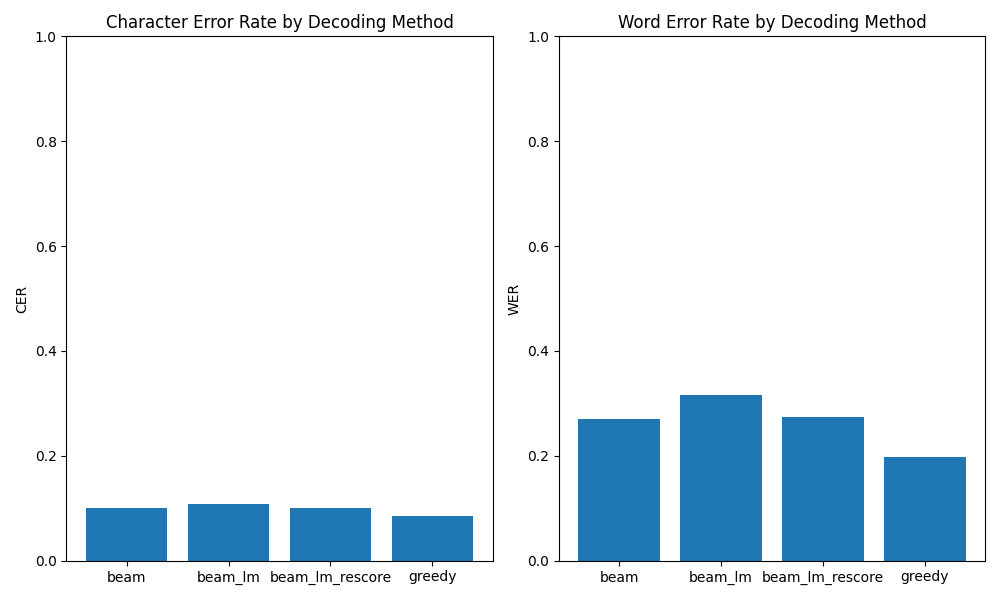
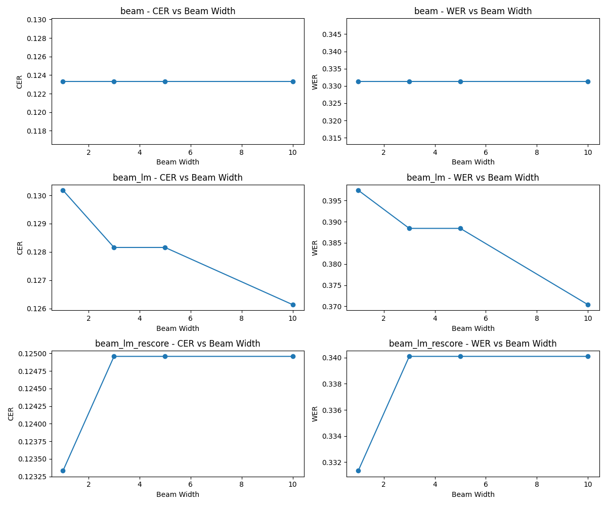
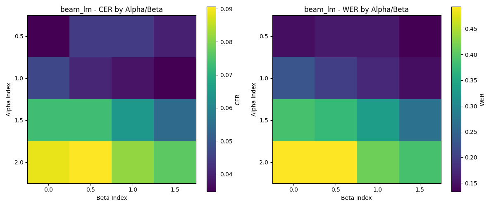
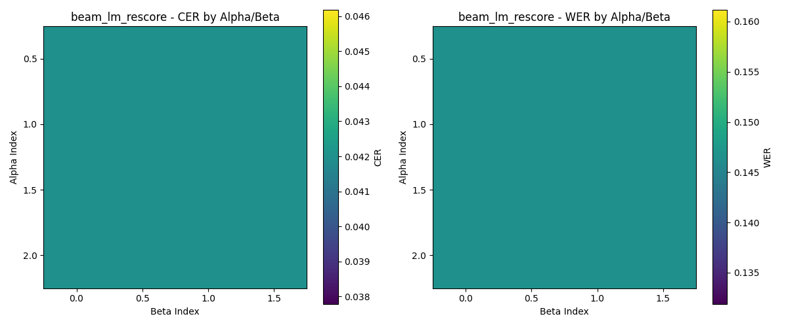
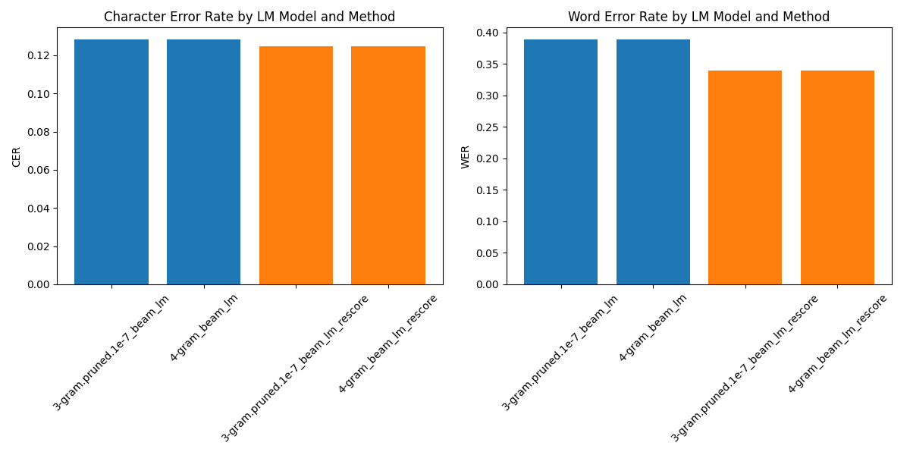

# ASR Decoding Experiments Report

## 1. Comparison of Decoding Methods

We implemented and compared four ASR decoding methods:
- Greedy decoding
- Beam search decoding
- Beam search with LM scores fusion
- Beam search with a second pass LM rescoring

### Results

| Method          |       CER |      WER |
|:----------------|----------:|---------:|
| beam            | 0.100943  | 0.270985 |
| beam_lm         | 0.108999  | 0.316647 |
| beam_lm_rescore | 0.101553  | 0.274274 |
| greedy          | 0.0849066 | 0.197297 |

## 2. Effect of Beam Width

We experimented with different beam width values to observe the effect on decoding quality.

### Results

| Method          |   Beam Width |      CER |      WER |
|:----------------|-------------:|---------:|---------:|
| beam            |            1 | 0.123331 | 0.331329 |
| beam            |            3 | 0.123331 | 0.331329 |
| beam            |            5 | 0.123331 | 0.331329 |
| beam            |           10 | 0.123331 | 0.331329 |
| beam_lm         |            1 | 0.13018  | 0.397431 |
| beam_lm         |            3 | 0.12816  | 0.388422 |
| beam_lm         |            5 | 0.12816  | 0.388422 |
| beam_lm         |           10 | 0.126139 | 0.370404 |
| beam_lm_rescore |            1 | 0.123331 | 0.331329 |
| beam_lm_rescore |            3 | 0.124957 | 0.340101 |
| beam_lm_rescore |            5 | 0.124957 | 0.340101 |
| beam_lm_rescore |           10 | 0.124957 | 0.340101 |

## 3. Effect of Alpha and Beta Parameters

We varied the language model weight (alpha) and word insertion bonus (beta) to find optimal values.

### Results

| Method          |   Alpha |   Beta |       CER |      WER |
|:----------------|--------:|-------:|----------:|---------:|
| beam_lm         |     0.5 |    0   | 0.0346637 | 0.146515 |
| beam_lm         |     0.5 |    0.5 | 0.0444198 | 0.159673 |
| beam_lm         |     0.5 |    1   | 0.0444198 | 0.159673 |
| beam_lm         |     0.5 |    1.5 | 0.0395418 | 0.133357 |
| beam_lm         |     1   |    0   | 0.0467849 | 0.227596 |
| beam_lm         |     1   |    0.5 | 0.0407243 | 0.200569 |
| beam_lm         |     1   |    1   | 0.037694  | 0.173542 |
| beam_lm         |     1   |    1.5 | 0.0346637 | 0.146515 |
| beam_lm         |     1.5 |    0   | 0.0735403 | 0.387624 |
| beam_lm         |     1.5 |    0.5 | 0.0735403 | 0.374111 |
| beam_lm         |     1.5 |    1   | 0.0644494 | 0.33357  |
| beam_lm         |     1.5 |    1.5 | 0.054102  | 0.26707  |
| beam_lm         |     2   |    0   | 0.0887657 | 0.492888 |
| beam_lm         |     2   |    0.5 | 0.0906135 | 0.492888 |
| beam_lm         |     2   |    1   | 0.0814486 | 0.41394  |
| beam_lm         |     2   |    1.5 | 0.0765706 | 0.387624 |
| beam_lm_rescore |     0.5 |    0   | 0.0419808 | 0.146515 |
| beam_lm_rescore |     0.5 |    0.5 | 0.0419808 | 0.146515 |
| beam_lm_rescore |     0.5 |    1   | 0.0419808 | 0.146515 |
| beam_lm_rescore |     0.5 |    1.5 | 0.0419808 | 0.146515 |
| beam_lm_rescore |     1   |    0   | 0.0419808 | 0.146515 |
| beam_lm_rescore |     1   |    0.5 | 0.0419808 | 0.146515 |
| beam_lm_rescore |     1   |    1   | 0.0419808 | 0.146515 |
| beam_lm_rescore |     1   |    1.5 | 0.0419808 | 0.146515 |
| beam_lm_rescore |     1.5 |    0   | 0.0419808 | 0.146515 |
| beam_lm_rescore |     1.5 |    0.5 | 0.0419808 | 0.146515 |
| beam_lm_rescore |     1.5 |    1   | 0.0419808 | 0.146515 |
| beam_lm_rescore |     1.5 |    1.5 | 0.0419808 | 0.146515 |
| beam_lm_rescore |     2   |    0   | 0.0419808 | 0.146515 |
| beam_lm_rescore |     2   |    0.5 | 0.0419808 | 0.146515 |
| beam_lm_rescore |     2   |    1   | 0.0419808 | 0.146515 |
| beam_lm_rescore |     2   |    1.5 | 0.0419808 | 0.146515 |

## 4. Comparison of Different Language Models

We compared the performance of different n-gram language models.

### Results

| Method          | LM Model           |      CER |      WER |
|:----------------|:-------------------|---------:|---------:|
| beam_lm         | 3-gram.pruned.1e-7 | 0.12816  | 0.388422 |
| beam_lm         | 4-gram             | 0.12816  | 0.388422 |
| beam_lm_rescore | 3-gram.pruned.1e-7 | 0.124957 | 0.340101 |
| beam_lm_rescore | 4-gram             | 0.124957 | 0.340101 |

## Conclusion

Based on our experiments, we can draw the following conclusions:

1. The **greedy decoding** method achieved the best results with a **WER of 0.197297** and **CER of 0.084907**.  
   This is an interesting finding, as more complex decoding methods involving language models did not outperform this baseline.

2. When analyzing the effect of **beam width**, we observed the following:
   - For **plain beam search**, increasing the beam width did not improve results (WER remained **0.331329** for all values).
   - For **beam_lm**, a small improvement was observed with larger beam widths:
     - WER decreased from **0.397431** (beam width = 1) to **0.370404** (beam width = 10).
   - For **beam_lm_rescore**, beam width had minimal effect:
     - Slightly worse WER at beam width 3–10 (**0.340101**) compared to width 1 (**0.331329**).

3. Experiments with **alpha** and **beta** parameters showed:
   - For **beam_lm**, best performance was achieved with **alpha = 0.5** and **beta = 1.5**:
     - WER: **0.133357**, CER: **0.0395418**.
   - Increasing **alpha** (LM weight) typically **worsened performance**, especially for **alpha > 1.0**.
   - The **beta** parameter (word insertion bonus) helped balance results:
     - Optimal values found in the **1.0–1.5** range.
   - For **beam_lm_rescore**, alpha and beta had **no observable effect**:
     - WER remained **0.146515** across all values.

4. Comparison of **3-gram vs 4-gram language models** showed **no difference** in performance:
   - For **beam_lm**: WER = **0.388422**, CER = **0.12816** (same for both models).
   - For **beam_lm_rescore**: WER = **0.340101**, CER = **0.124957** (same for both).
   - This suggests that a 3-gram model is sufficient for this test set, and adding a 4-gram model yields no additional benefits.